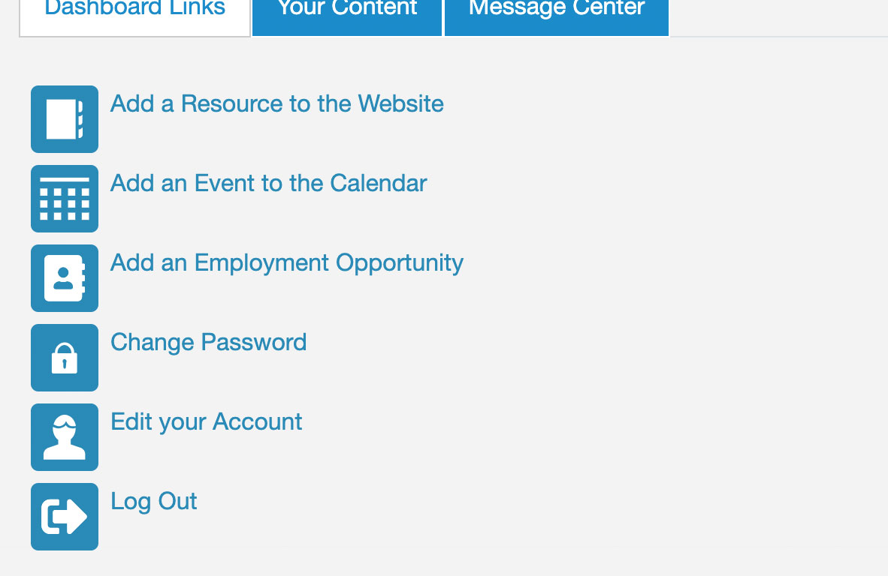

# Resource

## Add a Resource  

### Create Resource and Submit for Review

1. Log in to the site. After logging in, you'll see a list of actions you can perform.  
  

1. Select "add a resource to the website."  

1. Fill out the form. 

1. Submit form or save a draft. 
    1. Preview: User can see what the page will look like when published. 
    1. Save as Draft: Drafts are accessible via the user's profile page. There's a tab for "your content" which lists all content you've created. Click edit to resume working on a draft. 
    1. Submit for Approval: Clicking sumbit for approval puts the resource in an approval state, sends a message to the state administrator, and drops a message in the admin's message center.  

### Review and Make Live

1. Log in to the site as a state admin. Dashboard has additional tab for "state admin." Admins also see which states they administer. 

1. Click "state admin" and see a list of all content for your state. You can filter by moderation state. 

1. Click the title to view the content. 

1. State admin can do a couple of things once viewing the resource.
    1. Slow: They can click edit and then click "make live."
    1. Fast: They can scroll to the bottom of the screen to a blue admin control bar and click "make live" without having to edit the page. 
     

## Form Details

Info below highlights unique parts of form fields only.

1. Main Info > Organization / Business: This field has a special function to reduce duplicates. Start typing a word and there's a dialog box that lists possible duplicate content. 

1. Location Type: 
    1. The location type determines what flag shows up next to an event. There's a custom module that affects how the form works (which things are required or not). 
    1. Selecting "physical" is what makes a map be displayed on a resource page. 
    1. Physical: If physical, required to give a state. Can also add mailing address. 
    1. Virtual: If only virtual, state still required. But address is not asked. 
    1. National: If national, state is not required. 
    1. All: No state is required.  

1. County: County is there because some resources in TN are only available in certain counties. They have future plans to allow users to look for resources within a certin proximity to a county. 

1. Region: Currently only regions in TN. 

1. Convert to Profile: This makes a resource node take on the appearance of a profile page. Sandy wanted simple resources to become their own website. So, instead of looking and acting like all other resource pages, the resource would end up with a new theme and new functionality (kind of like making a Facebook page). Once you convert a resource to a profile you cannot change it back. 

1. Authorization info: 
    1. Set the state of ownership, like which state admins can manage the resource. 
    1. Authorization signature is not necessarily the person who is adding the resource. It refers to the person who is in charge of getting the resource added. For example, an intern might add the resource for Sandy (boss), but Sandy is the authorizing person. This allows Sandy to easily claim the resource later. 

## Claiming Resources

There's a system of "claiming" resources. This isn't like Wikipedia where every logged in user can edit content. You have to be an owner of the resource to edit it. 

1. If you're the authorized signature on a resource, you can claim ownership and immediately take ownership of a resource.

1. If you're not the authorized signature on a resource, you can claim a resource, but you don't take ownership immediately. Your request goes to an approval process and must be approved by an admin. 

## Locked Resources

In order to avoid collisions where two people are editing the same resource at the same time, resources become locked when the creator is editing. An admin can break the lock. Content editor can also break the lock. Lock expires after 15 minutes. 

## Message Center

Users have a message center tab on their profile page. This is a complex custom feature that replicate messages being sent to state admins by email. Users can define messaging preferences: 
- Get emails as they're sent.
- Get emails in a digest format each day or week.

Messages have links to view or approve content or message the user who submitted the content. 

State admins can see the entire history of who has updated the resource node. They can go into any point in the history and email the owner of the node. 

A tab /button will be added to the state admin profile to "message a user" so they do not have to find a user in the message history. 

## Additional Notes

- Expand all button on the "create resource" form is a special feature built with JavaScript. To "exapnd all" had to touch every part of the form which wasn't posssible without the custom JavaScript.