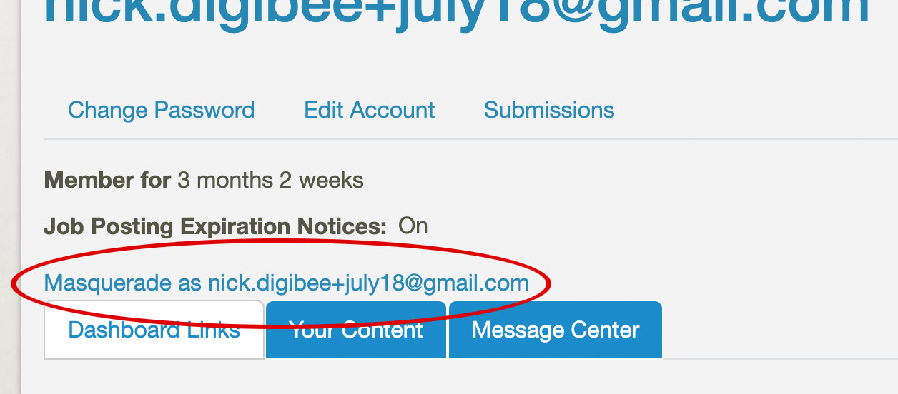

# Masquerade

Masquerade allows you to view a Drupal site as though you had the permissions of a different user. Once you masquerade, you are actually acting as that user and will no longer have access to admin menus and functions. 

To regain admin access and functions, you can log out and then log back in as an admin.

## Option 1

1. Log in as site admin.

1. Go to the user list: `admin > people`

1. Find a user with the permissions you need for your test. 

1. Click the user name. 

1. On the user profile page, click "Masqureade as [user email]."  

1. You're now viewing the site as though you were logged in as that user. 

## Option 2

1. Log in as site admin.

1. Scroll to the bottom of the home page. 

1. In the text box, type the email address for the user you want to masquearade as. 

1. Click "switch" and you should be viewing the site as though you were logged in as that user. 