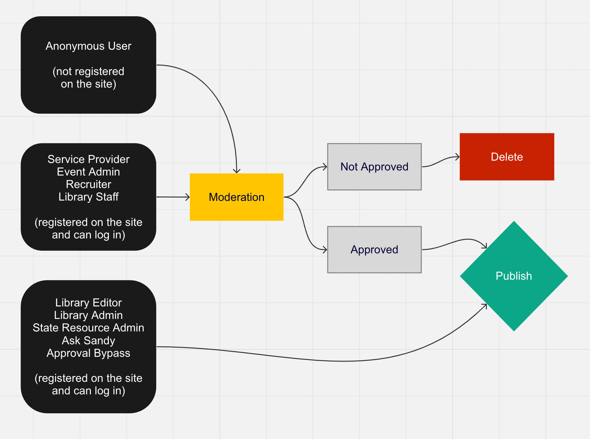

# Roles / Permissions

## All Roles in Order of Permissions (Most Permissions First)

- Administrator (NPL Staff, Development Partner)
- Library Admin (NPL Staff)
- Library Editor (NPL Staff)
- Library Staff (NPL Intern)
- State Resource Admin (NOT NPL)
- Resource Service Provider (NOT NPL)
- Event Admin (NOT NPL)
- Job Recruiter (NOT NPL)
- Ask Sandy (Elevates Permissions)
- Approval Bypass (Elevates Permissions)
- Unused - Service Admin: Can we delete this role? 
- Disable Messages (Changes Permissions)

## Developer Roles (Administrator)

The administrator role has full access over the entire site. This role can change any content or configuration setting. 

This role is managed by the Shared Systems team and is given to very few users. 

## Content and User Management Roles

The content management roles can view content awaiting moderation and can approve / publish content. These roles can also publish content without moderation. 

- Library Admin (NPL Staff)

- Library Editor (NPL Staff)

- Library Staff (NPL Staff)
   - Able to create new home page slides, new pages, new site wide alerts.
   - Able to manage home page slides, pages, and site wide alerts. 
   - Able to edit anyone's events, home page slides, pages, resources, and webforms. 

- State Resource Admin (NOT NPL)
   - 

## Content Approval Bypass Roles

These roles can log in and submit content that is immediately published. Content by these roles does not need moderation. 

- Ask Sandy: **Nick will look at notes to see if we still use this role.**

- Approval Bypass: Fixes some “troublesome issues.”  
    - Can edit content without notifiying content creator when changes are made.
    - Can post content without approval. 

## Content Contributer Roles

Anyone who registers for the Ask Sandy site using the online registration form is automatically granted the following roles: resource service provider, event admin, and job recruiter. All submitted content must be reviewed and approved by a higher-level role. 

- Resource Service Provider

- Event Admin

- Job Recruiter: 
   - Able to create new job posting content. Ability to manage their own job postings. (WAHT DOES 'MANAGE' MEAN?)
   - Ability to mark content for approval or deletion. 
   - All submitted content must be reviewed and approved by a higher-level role. 

## Authenticated Users

Is this basically the same level as service provider, event admin, and recruiter? Does this role have any permissions if this is the only box checked? Or can you just log in but not see anything? 

## Anonymous Users

These are general users who visit the site. They can access published content. Tehy can also use the anonymous submission form to submit resources for review **(or I think they can -- can't find the form)**

## Publishing Permissions Diagram

